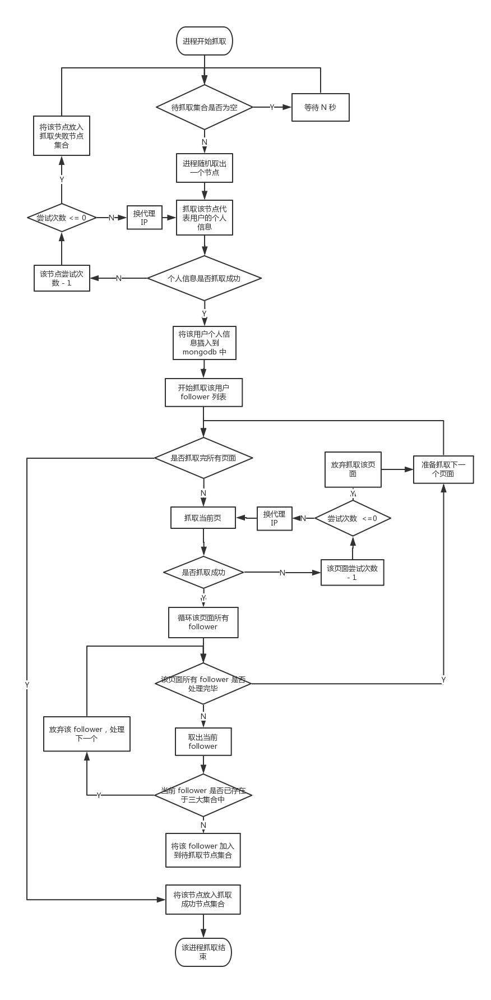

## zhihu_crawler_windows

知乎爬虫，windows版本，使用 mongodb 和 redis

### Redis 设计

redis 中设置五个集合：**待抓取节点集合** 和 **个人信息抓取成功节点集合** 和 **个人信息抓取失败节点集合** 和 **列表抓取成功节点集合** 和 **列表抓取失败节点集合**。

它们在 Redis 中分别命名为 **waiting / info\_success / info\_failed / list\_success / list\_failed**。

它们的关系为：
```
waiting --> info_success --> success
        `-> info_failed  `-> failed
```

**个人信息抓取进程** 从 待抓取节点集合 中随机取出一个节点，抓取该节点代表的用户信息。如果抓取成功，加入 个人信息抓取成功节点集合，如果抓取失败，加入 个人信息抓取失败节点集合。

**列表抓取进程** 从 个人信息抓取成功节点集合 中随机取出一个节点，抓取该节点的 follower 列表。如果抓取成功，加入 列表抓取成功节点集合，如果抓取失败，加入 列表抓取失败节点集合。

### 爬虫进程流程图



### 常用命令
* linux 启动 Redis  
```nohup redis-server redis.conf > /dev/null 2>&1 &```

* windows 备份 mongodb 数据到本地  
```mongodump -h localhost -d zhihu_crawler -o d:\temp```

* windows 恢复本地 mongodb 数据到远程主机  
```mongorestore.exe -h 60.205.212.2:27017 -d zhihu_crawler -directoryperdb d:\temp\zhihu_crawler```

* mongodb 修改数据库名称  
```
use admin;
db.runCommand({renameCollection: "irectoryperdb.peoples", to: "zhihu_crawler.peoples"});
```

* 远程连接 redis  
```redis-cli -h 60.205.212.2 -p 6379```

* mongodb 去重数据插入到新集合 shell 脚本
```
//待去重的集合 和 去重后的新集合
var CollectionName = 'peoples_201707121519'
var collection = db.getCollection(CollectionName)
var collection_distinct = db.getCollection(CollectionName + '_distinct')
//得到去重后的数组（只显示一个字段）
var arr = collection.distinct('urlToken');
print('去重前数据量:' + collection.count() + '\t去重后数据量:' + arr.length)
//将去重后的数据插入到新的集合中
for(var i in arr){
    print('正在插入第 ' + i +' 条去重数据')
    //取出完整数据
    var obj = collection.findOne({'urlToken':arr[i]})
    //插入到新集合中
    collection_distinct.insert(obj)
}
```
如果上一个脚本因为数据集太大处理不了，可以采用下面这个脚本：
```
//待去重的集合 和 去重后的新集合
var CollectionName = 'peoples'
var collection = db.getCollection(CollectionName)
var collection_distinct = db.getCollection(CollectionName + '_distinct')
//得到去重后的数组（只显示一个字段）
var cursor = collection.find();
cursor.forEach(function(item){
    var obj = collection.findOne({'urlToken':item.urlToken})
    collection_distinct.insert(obj)
})
```

### 参考资料
Python操作redis（python client 操作）  
http://www.cnblogs.com/melonjiang/p/5342505.html

Redis集合（redis 控制台操作）  
http://www.yiibai.com/redis/redis_sets.html

Redis系列-存储篇set主要操作函数小结（redis 并集操作，可以将一个 set 数据移动到另一个 set）  
http://blog.csdn.net/love__coder/article/details/8497497

Redis数据备份与恢复  
http://www.cnblogs.com/qinghub/p/5909921.html

MongoDB入门（3）- MongoDB备份与恢复  
http://www.cnblogs.com/wardensky/p/5799276.html

MongoDB 如何修改数据库名称  
https://segmentfault.com/q/1010000000694527

